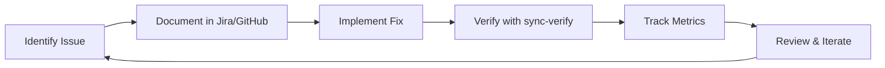

# Feedback & Continuous Improvement

## 🎯 How to Provide Feedback

### For Documentation Issues
1. Check [Confluence](https://balabushka.atlassian.net/wiki/spaces/LedZephyr) for the source
2. Add comments directly on Confluence pages
3. Or create a Jira issue under [LED project](https://balabushka.atlassian.net/browse/LED)

### For Code Issues
1. Create a GitHub issue with label `feedback`
2. Reference the specific file and line number
3. Suggest improvements in the issue description

### For Process Improvements
1. Rovo AI agents automatically detect issues
2. Document findings in Jira under Epic LED-46
3. Propose changes via pull request

## 📊 Automated Metrics

**Rovo AI Agents** automatically track:
- Documentation sync status
- Code coverage trends
- Test execution performance
- GitLab/Jira integration health

View dashboards in [Jira](https://balabushka.atlassian.net/browse/LED)

## 🔄 Feedback Loop Process

## 📈 Recent Improvements

Improvements are automatically tracked by Rovo AI agents and displayed in Jira dashboards.

## 🚀 Continuous Improvement Targets

| Metric | Current | Target | Status |
|--------|---------|--------|---------|
| Documentation Files | 3 | ≤3 | ✅ |
| Code Coverage | 53.6% | ≥60% | 🔄 |
| Lean Test Time | 530ms | <500ms | 🔄 |
| Doc Sync Errors | 0 | 0 | ✅ |

Submit feedback to improve these metrics!