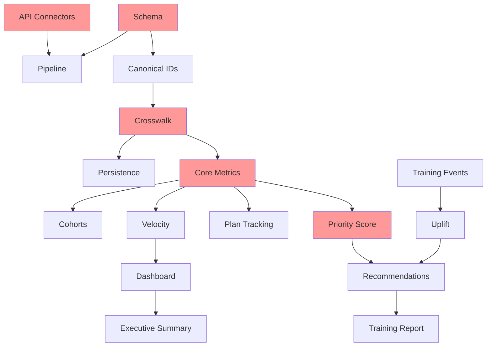

# Jira Work Items - MECE Structure
## Zephyr→qTest Adoption Intelligence Initiative

### 🎯 Initiative Goal
Measure Zephyr→qTest adoption and deploy training where it most accelerates migration completion, reducing migration time by 30% and training costs by $200K annually.

---

## 📊 MECE Epic Structure

### Epic 1: Data Foundation Layer
**Goal**: Establish reliable data ingestion and storage
**No overlap with**: Other epics (pure infrastructure)
**Completeness**: Covers all data sources and storage needs

#### LZ-101: API Data Connectors
- **Type**: Story
- **Points**: 8
- **Priority**: P0 - Blocker
- **Acceptance Criteria**:
  - [ ] Zephyr API client pulls test cases with 99.9% uptime
  - [ ] qTest API client handles rate limiting gracefully
  - [ ] Jira API client fetches migration wave plans
  - [ ] All connectors support incremental updates (updatedSince)
  - [ ] Error handling with exponential backoff implemented
- **Definition of Done**:
  - Unit tests pass (>90% coverage)
  - Integration tests with mocked APIs pass
  - Performance: <2s for 1000 records
  - Documentation complete

#### LZ-102: Data Schema Definition
- **Type**: Story
- **Points**: 5
- **Priority**: P0 - Blocker
- **Acceptance Criteria**:
  - [ ] Star schema designed with fact/dimension tables
  - [ ] DDL scripts for all tables created
  - [ ] Indexes optimized for query patterns
  - [ ] Partitioning strategy defined (by date/team)
- **Dependencies**: None
- **Definition of Done**:
  - Schema reviewed by DBA
  - Test data loads successfully
  - Query performance <100ms for dashboards

#### LZ-103: Data Pipeline Orchestration
- **Type**: Story
- **Points**: 5
- **Priority**: P0 - Blocker
- **Acceptance Criteria**:
  - [ ] Daily ETL job scheduled at 2 AM ET
  - [ ] Incremental updates every 4 hours
  - [ ] Failure alerts to #data-ops Slack channel
  - [ ] Retry logic with dead letter queue
  - [ ] Idempotent operations (can rerun safely)
- **Dependencies**: LZ-101, LZ-102
- **Definition of Done**:
  - 7 days of successful runs
  - Recovery tested from failure scenarios
  - SLA: 99% daily completion rate

---

### Epic 2: Identity Resolution System
**Goal**: Accurate cross-system entity matching
**No overlap with**: Data ingestion (Epic 1) or metrics calculation (Epic 3)
**Completeness**: All entity types and matching scenarios covered

#### LZ-201: Canonical ID Generation
- **Type**: Story
- **Points**: 3
- **Priority**: P0 - Blocker
- **Acceptance Criteria**:
  - [ ] Deterministic hash function implemented
  - [ ] Handles special characters and Unicode
  - [ ] No collisions in 1M record test set
  - [ ] Performance: 10K IDs/second generation
- **Dependencies**: LZ-102
- **Definition of Done**:
  - Unit tests with edge cases
  - Collision testing complete
  - Performance benchmarked

#### LZ-202: Crosswalk Mapping Engine
- **Type**: Story
- **Points**: 8
- **Priority**: P0 - Blocker
- **Acceptance Criteria**:
  - [ ] Exact matching on project+suite+title
  - [ ] Fuzzy matching with confidence scores
  - [ ] 95% accuracy on gold master dataset
  - [ ] Manual override capability
  - [ ] Audit trail of all mappings
- **Dependencies**: LZ-201
- **Definition of Done**:
  - Accuracy validated against 1000 manual mappings
  - Performance: <5s for 10K entity matching
  - UI for manual review implemented

#### LZ-203: Entity Persistence Layer
- **Type**: Story
- **Points**: 3
- **Priority**: P1 - High
- **Acceptance Criteria**:
  - [ ] Crosswalk mappings persisted to database
  - [ ] Version history maintained
  - [ ] Export/import functionality
  - [ ] Conflict resolution for duplicates
- **Dependencies**: LZ-202
- **Definition of Done**:
  - CRUD operations tested
  - Backup/restore verified
  - Data retention policy implemented

---

### Epic 3: Adoption Metrics Engine
**Goal**: Calculate and track migration metrics
**No overlap with**: Raw data (Epic 1) or training model (Epic 4)
**Completeness**: All required metrics and aggregations

#### LZ-301: Core Adoption Metrics
- **Type**: Story
- **Points**: 5
- **Priority**: P0 - Blocker
- **Acceptance Criteria**:
  - [ ] Adoption rate = migrated/total per team
  - [ ] Execution shift = qTest/(Zephyr+qTest) executions
  - [ ] Coverage retention = qTest requirements/baseline
  - [ ] Defect link parity tracked
  - [ ] Metrics calculated daily with <1% error margin
- **Dependencies**: LZ-202
- **Definition of Done**:
  - Metrics validated against manual calculations
  - Performance: <30s for all teams
  - Dashboard displays real-time metrics

#### LZ-302: Cohort Segmentation
- **Type**: Story
- **Points**: 3
- **Priority**: P1 - High
- **Acceptance Criteria**:
  - [ ] Users segmented: power/regular/long-tail
  - [ ] Dynamic cohort assignment based on activity
  - [ ] Cohort metrics aggregated separately
  - [ ] Historical cohort tracking
- **Dependencies**: LZ-301
- **Definition of Done**:
  - Cohort distribution validated
  - Cohort transitions tracked
  - Reports show cohort breakdown

#### LZ-303: Velocity & Trend Analysis
- **Type**: Story
- **Points**: 5
- **Priority**: P1 - High
- **Acceptance Criteria**:
  - [ ] Weekly velocity calculated (tests migrated/week)
  - [ ] Trend detection (accelerating/steady/slowing)
  - [ ] Completion date prediction with confidence intervals
  - [ ] Seasonality adjustment for holidays
- **Dependencies**: LZ-301
- **Definition of Done**:
  - Predictions within 15% accuracy
  - Historical validation complete
  - Confidence intervals displayed

#### LZ-304: Plan vs Actual Tracking
- **Type**: Story
- **Points**: 3
- **Priority**: P1 - High
- **Acceptance Criteria**:
  - [ ] Migration waves pulled from Jira
  - [ ] Variance calculation per team
  - [ ] Alert when >20% behind plan
  - [ ] Root cause tracking for delays
- **Dependencies**: LZ-301, LZ-101 (Jira)
- **Definition of Done**:
  - Plan data synchronized daily
  - Variance reports accurate
  - Alerts configured and tested

---

### Epic 4: Training Intelligence Model
**Goal**: Optimize training placement for maximum impact
**No overlap with**: Metrics (Epic 3) or reporting (Epic 5)
**Completeness**: Full training lifecycle from planning to measurement

#### LZ-401: Priority Scoring Algorithm
- **Type**: Story
- **Points**: 5
- **Priority**: P0 - Blocker
- **Acceptance Criteria**:
  - [ ] 6-factor weighted scoring implemented
  - [ ] Scores reproducible (same input = same output)
  - [ ] Weights configurable via admin UI
  - [ ] Score explanation generated
  - [ ] Historical score tracking
- **Dependencies**: LZ-301
- **Definition of Done**:
  - Algorithm validated by training team
  - A/B testing framework ready
  - Performance: <100ms per team

#### LZ-402: Training Event Tracking
- **Type**: Story
- **Points**: 3
- **Priority**: P1 - High
- **Acceptance Criteria**:
  - [ ] Training events imported from calendar
  - [ ] Attendance tracked per session
  - [ ] Topics and materials linked
  - [ ] Feedback scores collected
  - [ ] Cost tracking per session
- **Dependencies**: None
- **Definition of Done**:
  - Historical data imported (past 6 months)
  - Integration with calendar system
  - Reporting dashboard live

#### LZ-403: Uplift Measurement
- **Type**: Story
- **Points**: 8
- **Priority**: P1 - High
- **Acceptance Criteria**:
  - [ ] Pre/post training metrics compared
  - [ ] Control group comparison implemented
  - [ ] Statistical significance testing
  - [ ] ROI calculation (value/cost)
  - [ ] Negative impact detection
- **Dependencies**: LZ-401, LZ-402
- **Definition of Done**:
  - Uplift validated against 10 past trainings
  - Statistical methods peer-reviewed
  - ROI dashboard implemented

#### LZ-404: Recommendation Engine
- **Type**: Story
- **Points**: 5
- **Priority**: P1 - High
- **Acceptance Criteria**:
  - [ ] Top 5 teams recommended weekly
  - [ ] Topic selection based on team needs
  - [ ] Trainer capacity constraints honored
  - [ ] Blackout dates respected
  - [ ] Recommendation explanations provided
- **Dependencies**: LZ-401, LZ-403
- **Definition of Done**:
  - Recommendations validated by training team
  - Schedule optimization tested
  - Email notifications configured

---

### Epic 5: Reporting & Visualization
**Goal**: Deliver actionable insights to stakeholders
**No overlap with**: Data processing (Epics 1-4)
**Completeness**: All stakeholder needs addressed

#### LZ-501: Daily Adoption Dashboard
- **Type**: Story
- **Points**: 5
- **Priority**: P0 - Blocker
- **Acceptance Criteria**:
  - [ ] Real-time adoption metrics displayed
  - [ ] Team leaderboard with filters
  - [ ] Trend charts with drill-down
  - [ ] Mobile-responsive design
  - [ ] Export to PDF/Excel
- **Dependencies**: LZ-303
- **Definition of Done**:
  - User acceptance testing passed
  - Load testing: 100 concurrent users
  - Documentation and training complete

#### LZ-502: Training Impact Report
- **Type**: Story
- **Points**: 3
- **Priority**: P1 - High
- **Acceptance Criteria**:
  - [ ] Weekly training recommendations
  - [ ] Historical uplift analysis
  - [ ] ROI summary with trends
  - [ ] Automated email distribution
  - [ ] Confluence integration
- **Dependencies**: LZ-404
- **Definition of Done**:
  - Report validated by stakeholders
  - Automated generation tested
  - Distribution list configured

#### LZ-503: Executive Summary Generator
- **Type**: Story
- **Points**: 3
- **Priority**: P2 - Medium
- **Acceptance Criteria**:
  - [ ] One-page PDF summary
  - [ ] Key metrics and trends
  - [ ] Risk indicators highlighted
  - [ ] Natural language insights
  - [ ] Branded template
- **Dependencies**: LZ-501, LZ-502
- **Definition of Done**:
  - Executive team approval
  - Automated monthly generation
  - Archive system implemented

---

### Epic 6: Operations & Monitoring
**Goal**: Ensure system reliability and performance
**No overlap with**: Feature development (Epics 1-5)
**Completeness**: Full operational coverage

#### LZ-601: Health Monitoring
- **Type**: Story
- **Points**: 3
- **Priority**: P1 - High
- **Acceptance Criteria**:
  - [ ] Health check endpoints for all services
  - [ ] Prometheus metrics exposed
  - [ ] Grafana dashboards configured
  - [ ] Alert rules defined (PagerDuty)
  - [ ] SLA tracking (99.9% uptime)
- **Dependencies**: All epics
- **Definition of Done**:
  - Monitoring validated in staging
  - Runbook documented
  - On-call rotation established

#### LZ-602: Data Quality Gates
- **Type**: Story
- **Points**: 5
- **Priority**: P1 - High
- **Acceptance Criteria**:
  - [ ] Schema validation on ingestion
  - [ ] Anomaly detection (>3σ changes)
  - [ ] Completeness checks (null fields)
  - [ ] Referential integrity validation
  - [ ] Data lineage tracking
- **Dependencies**: LZ-103
- **Definition of Done**:
  - Quality rules implemented
  - Alert thresholds tuned
  - Recovery procedures tested

#### LZ-603: Backup & Recovery
- **Type**: Story
- **Points**: 3
- **Priority**: P1 - High
- **Acceptance Criteria**:
  - [ ] Daily automated backups
  - [ ] Point-in-time recovery tested
  - [ ] Cross-region replication
  - [ ] Recovery time < 4 hours
  - [ ] Backup validation automated
- **Dependencies**: LZ-102
- **Definition of Done**:
  - Disaster recovery drill passed
  - Documentation complete
  - Compliance audit passed

---

## 📈 Sizing Summary

| Epic | Stories | Total Points | Priority |
|------|---------|--------------|----------|
| 1. Data Foundation | 3 | 18 | P0 |
| 2. Identity Resolution | 3 | 14 | P0 |
| 3. Adoption Metrics | 4 | 16 | P0/P1 |
| 4. Training Intelligence | 4 | 21 | P0/P1 |
| 5. Reporting | 3 | 11 | P0/P1 |
| 6. Operations | 3 | 11 | P1 |
| **TOTAL** | **20** | **91** | - |

---

## 🔄 Dependencies & Critical Path



**Critical Path** (in red):
LZ-102 → LZ-201 → LZ-202 → LZ-301 → LZ-401 → LZ-404 → LZ-502

---

## ⏱️ Sprint Planning (2-week sprints)

### Sprint 1: Foundation
- LZ-101: API Connectors (8)
- LZ-102: Schema Definition (5)
- LZ-201: Canonical IDs (3)
- **Total: 16 points**

### Sprint 2: Identity & Pipeline
- LZ-103: Pipeline Orchestration (5)
- LZ-202: Crosswalk Engine (8)
- LZ-203: Persistence (3)
- **Total: 16 points**

### Sprint 3: Core Metrics
- LZ-301: Core Adoption Metrics (5)
- LZ-302: Cohort Segmentation (3)
- LZ-303: Velocity Analysis (5)
- LZ-304: Plan Tracking (3)
- **Total: 16 points**

### Sprint 4: Training Model
- LZ-401: Priority Scoring (5)
- LZ-402: Event Tracking (3)
- LZ-403: Uplift Measurement (8)
- **Total: 16 points**

### Sprint 5: Recommendations & Reporting
- LZ-404: Recommendation Engine (5)
- LZ-501: Dashboard (5)
- LZ-502: Training Report (3)
- **Total: 13 points**

### Sprint 6: Operations & Polish
- LZ-503: Executive Summary (3)
- LZ-601: Health Monitoring (3)
- LZ-602: Data Quality (5)
- LZ-603: Backup & Recovery (3)
- **Total: 14 points**

---

## ✅ MECE Validation

### Mutually Exclusive Check ✓
- Each epic has distinct scope with no overlap
- No story appears in multiple epics
- Clear boundaries between data/logic/presentation layers

### Collectively Exhaustive Check ✓
- **Data Sources**: All 3 systems covered (Zephyr, qTest, Jira)
- **Processing**: Identity, metrics, and training logic complete
- **Outputs**: Dashboard, reports, and API endpoints
- **Operations**: Monitoring, quality, and backup covered
- **Users**: Teams, trainers, and executives addressed

---

## 🎯 Success Metrics

| Metric | Baseline | Target | Measurement |
|--------|----------|--------|-------------|
| Migration Velocity | 100 tests/week | 150 tests/week | Weekly average |
| Training ROI | Unknown | 300% | (Uplift value - Cost)/Cost |
| Adoption Accuracy | ~70% | 95% | Manual validation sample |
| Report Generation | Manual (4 hrs) | Automated (<5 min) | Time to generate |
| Training Placement | Intuition | Data-driven | Score variance |

---

## 🚀 Definition of Ready

Before any story starts:
- [ ] Acceptance criteria reviewed with PO
- [ ] Dependencies identified and ready
- [ ] Test data available
- [ ] Design approved (if applicable)
- [ ] No blockers identified

## 🏁 Definition of Done

For all stories:
- [ ] Code complete and reviewed
- [ ] Unit tests pass (>80% coverage)
- [ ] Integration tests pass
- [ ] Documentation updated
- [ ] Deployed to staging
- [ ] PO acceptance in staging
- [ ] Production deployment plan ready

---

## 📝 Notes for Jira Import

```csv
Issue Type,Summary,Description,Epic Link,Story Points,Priority,Acceptance Criteria
Epic,Data Foundation Layer,Establish reliable data ingestion and storage,,18,Highest,See epic description
Story,API Data Connectors,Create connectors for Zephyr qTest and Jira APIs,LZ-100,8,Highest,"- Zephyr API client pulls test cases
- qTest API client handles rate limiting
- Jira API client fetches migration waves
- All support incremental updates
- Error handling with backoff"
```

This structure ensures:
1. **No gaps**: Every aspect of the adoption intelligence system is covered
2. **No overlaps**: Each epic and story has distinct responsibilities
3. **Clear dependencies**: Critical path identified
4. **Measurable outcomes**: Specific acceptance criteria
5. **Realistic sizing**: Based on complexity and risk
6. **Business value**: Tied to $200K savings and 30% time reduction